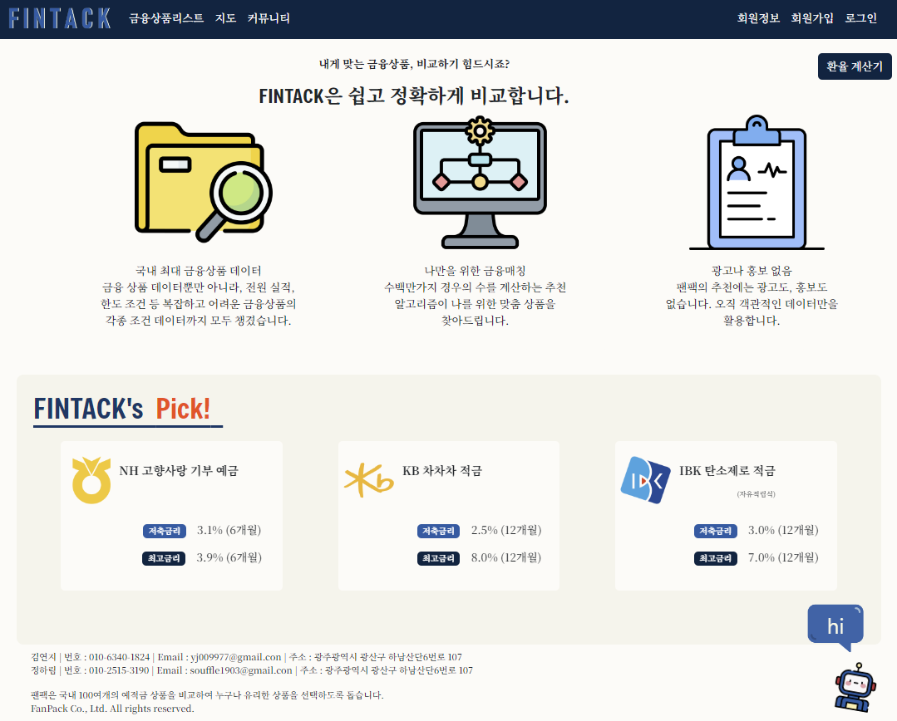
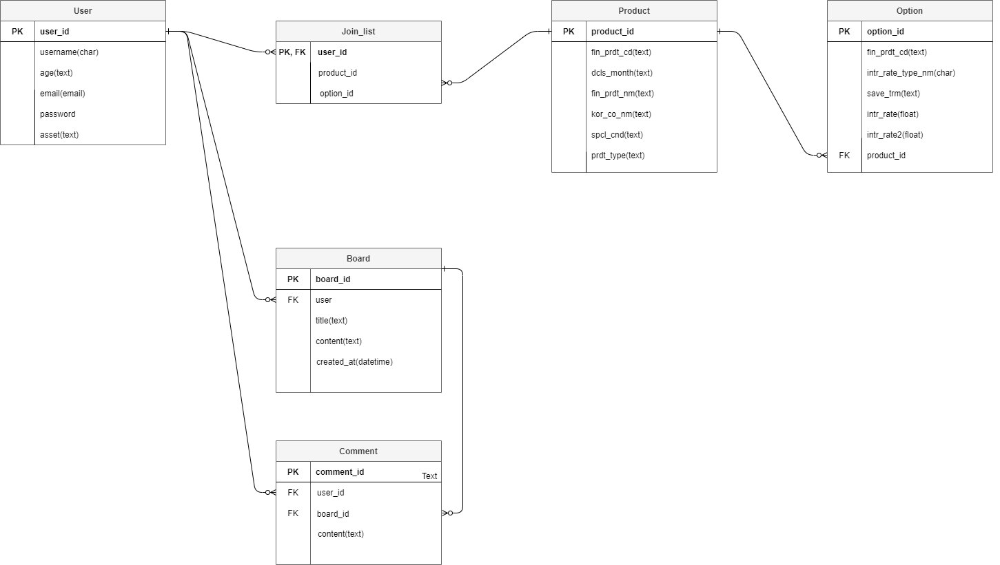
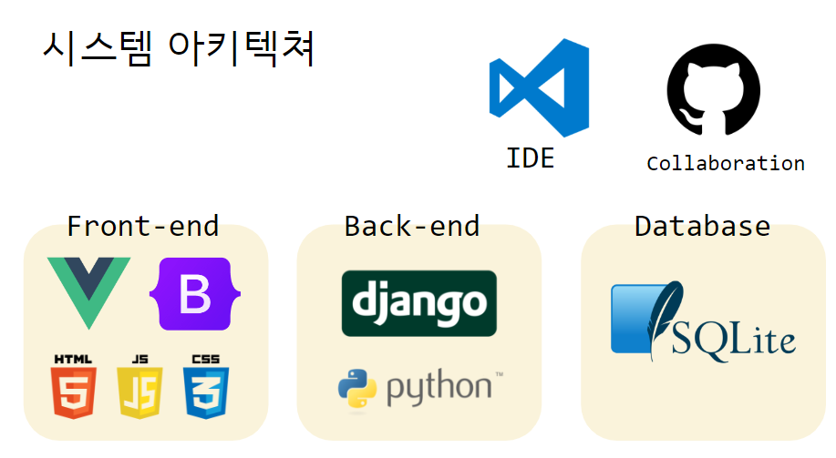

# FINPACK(금융상품비교 프로젝트)

## 제작 기간 & 팀원 소개
- 2024년 5월 16일 ~ 5월 23일

|일자|구현기능|
|------|---|
|5월16일| - 프로젝트 계획 및 ERD 작성 - 정기예금 및 적금 API 및 현재 환율정보 API 요청 - 금융 상품 및 환율 DB생성|
|5월17일| - ERD 수정 - 금융 상품 리스트 기능 구현 - 금융 상품 상세 정보 기능 구현 - 환율계산기 기능 구현|
|5월19일| - 환율 데이터 실시간 요청으로 변경 - 유저 커스터마이징 구현 - 카카오맵 API로 은행 지도 구현|
|5월20일| - 회원 기능 구현 - 게시판 기능 구현 - 회원의 금융 상품 가입 기능|
|5월21일| - 게시글 삭제/수정 기능 구현 - 로그아웃/프로필 수정 기능 구현 - 상품 추천 챗봇 구현|
|5월22일|- CSS - 회원탈퇴 - 챗봇 수정  - 상품 그래프 구현|
|5월23일|- CSS - 트러블슈팅 - 오류수정|
|5월23일|- CSS - 트러블슈팅 - 오류수정|
 

 

||김연지|정하림|
|------|---|---|
||팀장|팀원|
||Back-end & Front-end|Back-end & Front-end|
|업무 분담|- 회원가입 기능 - 로그인, 로그아웃, 회원탈퇴 기능 - 프로필 페이지 기능 - 커뮤니티 기능 - 게시글 작성, 수정, 삭제 기능 - 댓글 작성, 삭제 기능 - 가입상품 목록 확인기능|- API 요청 및 DB 생성 - 상품 리스트 및 상세 정보 기능 관련 기능 - 상품 추천 챗봇 기능  - 환율 계산기 기능 - 금융 상품 가입 기능  - 상품 관련 그래프 기능|
|github|[@yjkim9497](https://github.com/yjkim9497/KIMYEONJI)|[@souffle1903](https://github.com/souffle1903/ChungHalim)|

## ERD

## 기술스택
### IDE

### Collaboration

### Back-End

### Front-End

### DB

## 시스템 아키텍쳐

## 사용 API
- [금융감독원 예금 API](https://finlife.fss.or.kr/finlife/api/fdrmDpstApi/list.do?menuNo=700052)
- [금융감독원 적금 API](https://finlife.fss.or.kr/finlife/api/fdrmEntyApi/list.do?menuNo=700053)
- [한국수출입은행 환율정보 API](https://www.koreaexim.go.kr/ir/HPHKIR020M01?apino=2&viewtype=C&searchselect=&searchword=)
- [카카오맵 API](https://apis.map.kakao.com/web/)
- [OpenAI Chat API](https://platform.openai.com/overview)

## 주요 기능
1. 메인페이지
    - navbar를 이용한 전체 페이지 이동 구현, 로그인 여부에 따라 나타나는 버튼 토글(회원가입, 로그인/로그아웃,회원정보)
    
2. 회원 커스터마이징
    - username(아이디), email(이메일), password(비밀번호), age(나이), asset(자산) 를 입력받을 수 있는 회원가입 기능 커스터마이징
3. 예적금 금리 비교
    - 금융감독원 예적금 api를 이용하여 DB생성 후 상품리스트와 상품 세부사항 확인기능 구현
4. 환율 계산기
    - 실시간 환율정보를 확인할 수 있는 기능 구현
5. 근처 은행 검색
    - 카카오맵 api를 이용하여 지역별 은행위치 확인 기능 구현
6. 커뮤니티
    - 회원 간 소통할 수 있는 게시판 기능 구현
7. 프로필 페이지
    - 로그인 한 유저의 정보와 가입한 상품리스트를 확인할 수 있는 프로필 기능 구현
8. 금융 상품 추천 알고리즘(챗봇)
    - Chat GPT Open AI를 이용한 상품 추천 안내 기능 구현

## 트러블 슈팅
- 김연지
1. 커스텀 유저 모델 사용과 drf의 auth_user 모델을 같이 사용하려 하니 null 오류가 계속해서 발생   
 -> managers파일을 생성하여 user모델 커스텀   
 -> models.py에서 장고 auth모델의 permissionsmixin를 가져온후 managers에서 UserManager를 임포트   
 -> 회원가입 view함수 내에서 drf의 serializer를 가져온 후 request.data를 추가해서 해결
 2. 사용자 인증 기능   
- 정하림
1. 환율 정보 API는 프론트엔드에서 요청을 막아두었는데 코드의 문제라고 생각하고 계속 CORS 오류 발생을 해결하려고 함. -> 백엔드에서 요청으로 해결함.
 2. DB에 저장된 정보를 불러와 뷰에서 받는 과정에서 오류가 발생함.  특정 컴포넌트 호출시 정보를 가져오도록 설정해 두었더니 다른 컴포넌트를 먼저 방문할 때 데이터가 없는 오류가 발생함. -> 요청 위치를 App.vue로 변경
 3. 가입 상품 모델(JoinList) 생성할 때 3 개(User, Product, Option)의 모델을 모두 연결하다보니 오류가 남. -> User와 Option만 받아주고 Product 정보는 Option의 Foreign key로 연결해서 가져옴. 

 ## 후기 및 느낀점
 - 김연지 : 기간이 충분하다고 생각했는데 구현할 기능이 많아서 시간이 다소 촉박하게 느껴졌다. 커스텀 유저모델을 만드려고 하면서 오류가 많이 발생해 가장 시간이 오래걸렸다. 장고와 뷰를 각각 학습하여서 두가지를 연결하는 것은 실습때 많이 안해봐서 여기서도 어려움을 겪었다. 그래도 과제로 주어진 구현해야 하는 기능들을 전부 구현에 성공하였고 나만의 웹페이지가 완성되어서 뿌듯하였다. 검색기능이나 페이징 기능도 추가하고 싶었는데 시간 문제로 구현하지 못해서 아쉬웠다.
 - 정하림 : 첫 프로젝트라서 시작을 어떻게 해야 하는지 걱정이 많았다. 프로젝트 경험이 있는 팀장 덕분에 계획을 잘 세울 수 있었다. 그동안 Django와 Vue는 별개로 나누어 데이터를 불러왔기 때문에 이 둘을 연결하는 부분이 가장 어려웠던 것 같다. 첫 모델의 데이터를 보내주는 것을 성공하고 나머지 모델들은 비교적 쉽게 진행되어 많이 배울 수 있었던 프로젝트였다. 사용한 데이터 안에서 금융 상품을 분류할만한 조건이 많지 않아서 개인에게 맞는 상품 추천을 하는데 한계가 있었다. 가입한 고객의 자산 정보를 얻을 수 있다면 그 데이터를 가지고 분석해 보고 싶다. 또, 지도 구현에서 GPS 정보를 불러올 수 없어서 지도 초기화면을 사용자 위치 기준이 아닌 특정 위치로 고정해 둔 것이 아쉬웠다. 끝으로 한 학기 동안 공부하면서 GPT를 사용하는 데 조금 반감이 있었다. 그러나 지도 구현에서 필요했던 각 지역의 위/경도 수집 등 어려운 것이 아니라 시간이 오래 걸리는 부분에서 큰 도움이 되고 그것이 프로젝트에서 시간을 허투루 쓰지 않게 해 줄 수 있다는 것을 배웠다.
